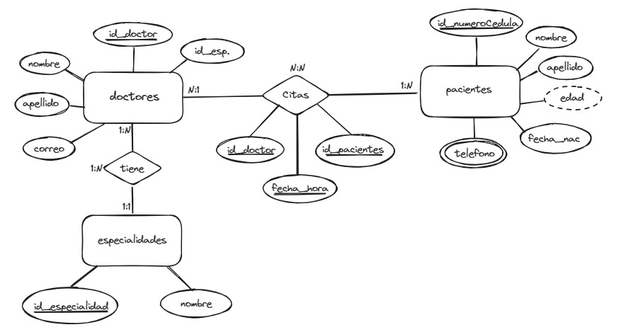
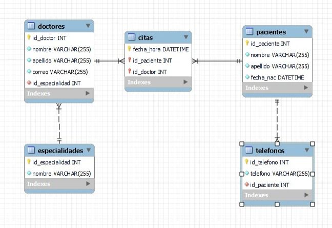
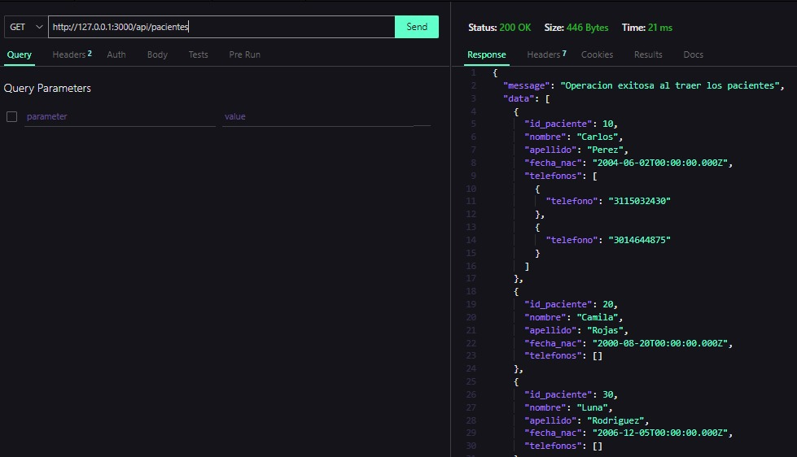
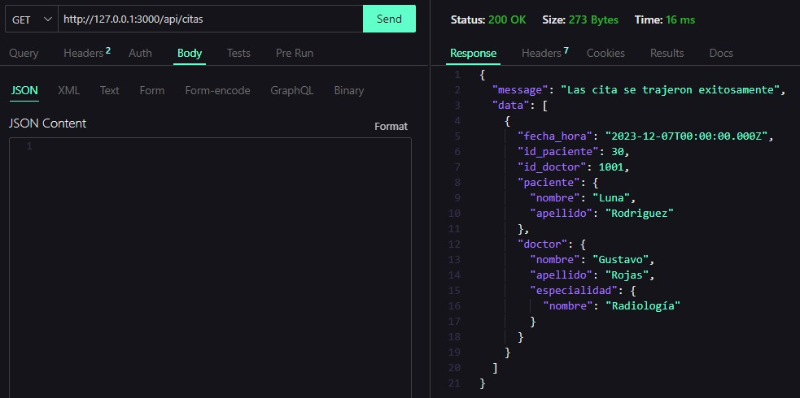
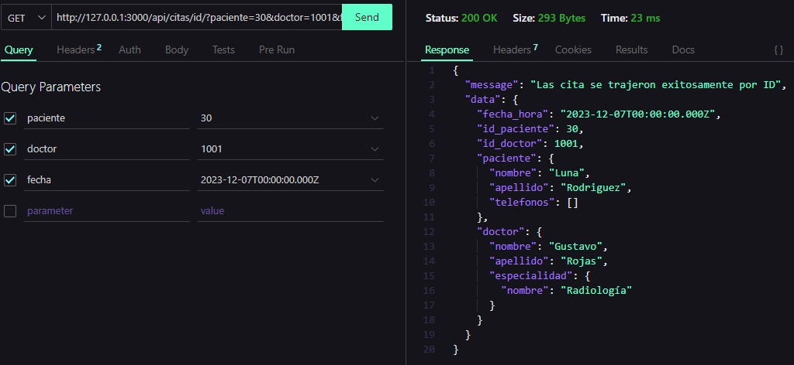
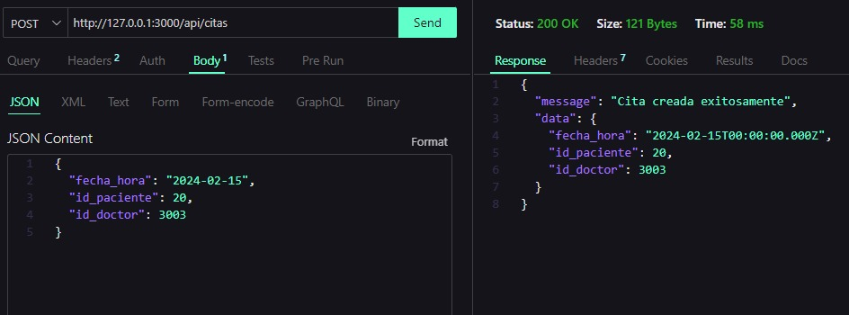
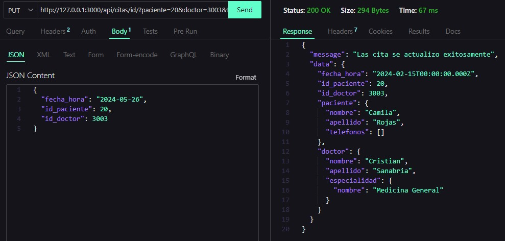
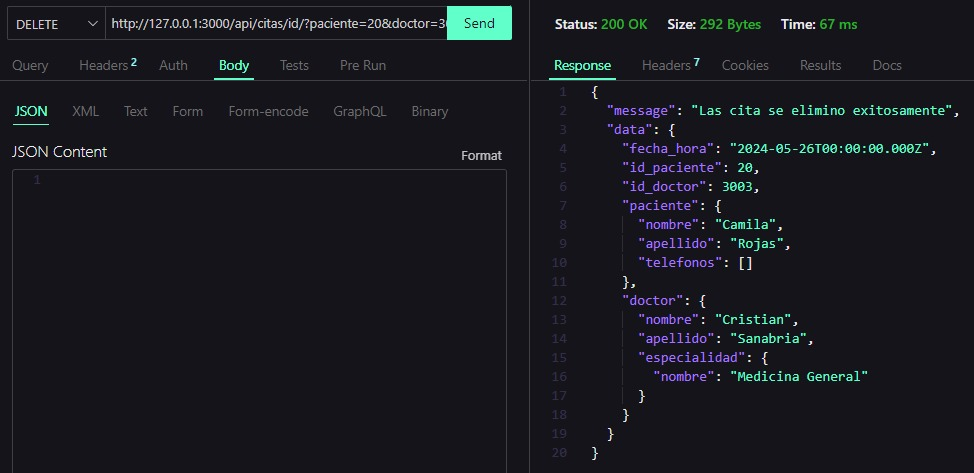

# Proyecto API REST Módulo 6
---
## Topics :memo:

:open_file_folder: Este repositorio contiene los siguientes temas:

1. Contexto de la API
2. Tecnologías empleadas.
3. Pasos para la instalación y uso de la API.
4. Estructuración de la base de datos.
5. EndPoints de la API.
6. Pruebas de la API
7. Desarrolladores.
<br>

## 1. Contexto
---
Esta API se desarrolló para el curso de Desarrollo web Backend intermedio con la finalidad de emplear y demostrar los conocimientos adquiridos durante las clases vistas en donde, el proyecto intermedio del curso consiste en crear una API REST simulando el comportamiento de un sistema médico que permite realizar diferentes acciones como crear, visualizar, editar y eliminar los pacientes, doctores y/o citas, logrando así evidenciar el uso de los métodos de petición HTTP y de las diferentes tecnologías aprendidas
## 2. Tecnologías empleadas
---
Para la realización de la API, se hizo uso de las siguientes tecnologías:

| Tecnología | Documentación |
| ------ | ------ |
| Node JS | https://nodejs.org/en |
| TypeScript | https://www.typescriptlang.org/docs/ |
| Express | http://expressjs.com/ |
| MySQL | https://dev.mysql.com/doc/ |
| Sequelize | https://sequelize.org/docs/v6/getting-started/ |

## 3. Estructuración de la base de datos
---
Para la creación de la base de datos de la API se empleo el siguiente modelo entidad relación:


# 4. Pasos para la instalación y uso de la API
---
1. Instalación de un editor de texto (Visual Studio Code)
2. Instalación de Node JS
3. Para verificar la instalacion de Node JS y NPM, ejecute los siguientes comandos:
```sh
node --version
```
```sh
npm --version
```
4. Clonar este repositorio 
```sh
git clone https://github.com/su usuario/basic_api_rest.git
cd basic_api_rest
```
5. Inicializar un proyecto con `npm`
```sh
npm init
```
6. Instalar dependencias
```sh
npm i body-parser cors dotenv express mysql2 sequelize sequelize-typescript 
```
7. Instalar las dependencias de desarrollador
```sh
npm i @types/body-parser @types/cors @types/dotenv @types/express @types/mysql @types/node nodemon ts-node --save dev
```
8. En el archivo `package.json`, agregue un script que diga lo siguiente:
```sh
"scripts": {
    "start": "tsc && nodemon dist/app.js",
    "dev": "tsc && nodemon src/app.ts"
  }
```
9. Inicializa la configuración de TypeScript con el comando `npx tsc --init`. Esto creará un archivo `tsconfig.json` del proyecto.
```sh
npx tsc --init
```
8. Configura las opciones del compilador de TypeScript en tu archivo `tsconfig.json`:
```json
"compilerOptions": {
    "target": "es6",   
    "module": "commonjs",
    "outDir": "./dist",
    "strict": true,
    "esModuleInterop": true,
    "experimentalDecorators": true,
    "emitDecoratorMetadata": true,
}
```
7. Ir a la terminal de MySQL o al Workbench y ejecutar el siguiente query:
```sh
create database eps;
```
8. Iniciar el servidor
```sh
npm run dev
```
# 5. EndPoints de la API
---
Para el sistema creamos los siguientes Endpoints:
#### Endpoints para pacientes
| Metodo | Endpoint | Descripción |
| ------ |---- | ------ |
| `get` | `/api/pacientes` | Obtener los datos de todos los pacientes |
| `get` | `/api/pacientes/citas` | Obtener los datos de todos los pacientes con citas asignadas |
| `get` | `/api/pacientes/id` | Obtener los datos de paciente por ID |
| `get` | `/api/pacientes/citas/id` | Obtener los datos de paciente por ID con citas asignadas |
| `post` | `/api/pacientes` | Crear pacientes |
| `put` | `/api/pacientes/id` | Actualizar los datos del paciente |
| `delete` | `/api/pacientes/id` | Eliminar el registro del paciente |

#### Endpoints para telefonos de pacientes
| Metodo | Endpoint | Descripción |
| ------ |---- | ------ |
| `get` | `/api/telefonos` | Obtener los datos de todos los telefonos |
| `get` | `/api/telefonos/id` | Obtener los datos de telefonos por ID |
| `post` | `/api/telefonos` | Crear telefonos |
| `put` | `/api/telefonos/id` | Actualizar los datos del telefono |
| `delete` | `/api/telefonos/id` | Eliminar el registro del telefono |

#### Endpoints para doctores
| Metodo | Endpoint | Descripción |
| ------ |---- | ------ |
| `get` | `/api/doctores` | Obtener los datos de todos los doctores |
| `get` | `/api/doctores/citas` | Obtener los datos de todos los doctores con citas programadas |
| `get` | `/api/doctores/id` | Obtener los datos de doctores por ID |
| `get` | `/api/doctores/citas/id` | Obtener los datos de doctores por ID con citas programadas|
| `post` | `/api/doctores` | Crear doctores |
| `put` | `/api/doctores/id` | Actualizar los datos del doctores |
| `delete` | `/api/doctores/id` | Eliminar el registro del doctores |

#### Endpoints para las especialidades
| Metodo | Endpoint | Descripción |
| ------ |---- | ------ |
| `get` | `/api/especialidades` | Obtener los datos de todos las especialidades |
| `get` | `/api/especialidades/id` | Obtener los datos de las especialidades por ID |
| `post` | `/api/especialidades` | Crear especialidades |
| `put` | `/api/especialidades/id` | Actualizar los datos de la especialidad |
| `delete` | `/api/especialidades/id` | Eliminar el registro de la especialidad |

#### Endpoints para las citas
| Metodo | Endpoint | Descripción |
| ------ |---- | ------ |
| `get` | `/api/citas` | Obtener los datos de todas las citas |
| `get` | `/api/citas/id` | Obtener los datos de las ecitas por ID |
| `post` | `/api/citas` | Crear citas |
| `put` | `/api/citas/id` | Actualizar los datos de la cita |
| `delete` | `/api/citas/id` | Eliminar el registro de la cita |
# 6. Pruebas de la API
---
Para cuestion de nuestras pruebas, usamos la extension de Visual Studio Code `Thunder Client`
A continuación vamos a mostrar las pruebas de cada uno de los métodos_

### Pruebas para pacientes
Obtener todos los pacientes
<br>

Obtener todos los pacientes con citas


Obtener el paciente por id


Obtener el paciente con cita por id


Crear paciente


Actualizar paciente


Eliminar paciente


### Pruebas para doctores

> :warning: **Aviso**: para poder crear registros de doctores, se debe tener registros en la tabla se especialidades .

Obtener todos los doctores
<br>

Obtener todos los doctores con citas programadas


Obtener el doctor por id


Obtener el doctores con cita programada por id


Crear doctores


Actualizar doctores


Eliminar doctor


### Pruebas para citas

Obtener todas las citas


Obtener la cita por id


Crear citas


Actualizar cita


Eliminar cita


### Pruebas para especialidades

Obtener todas las especialidades


Obtener la especialidad por id


Crear especialidades


Actualizar especialidad


Eliminar especialidad


### Pruebas para telefonos

Obtener todos los telefonos


Obtener el teléfono por id


Crear telefonos


Actualizar telefono


Eliminar telefono


# 7. Desarrolladores
---
Este proyecto se desarrolló en colaboración de:
<br>
>:saxophone: María Alejandra Cruz 
>:whale2: Jorge Daniel Gómez 
>:smile_cat: Johan Sebastián Gónzalez 
---